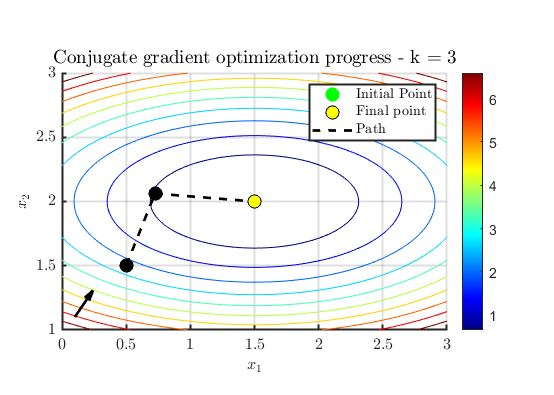
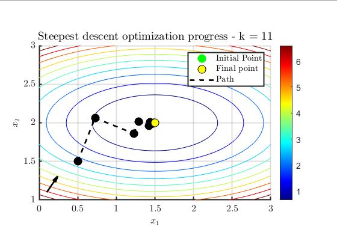
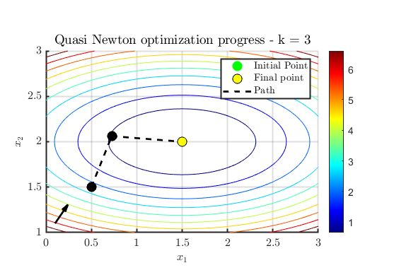
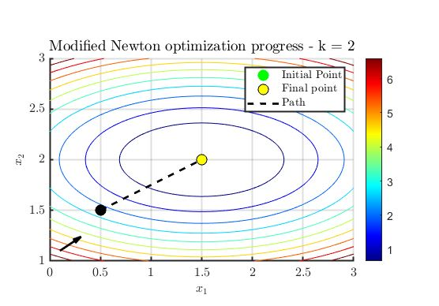
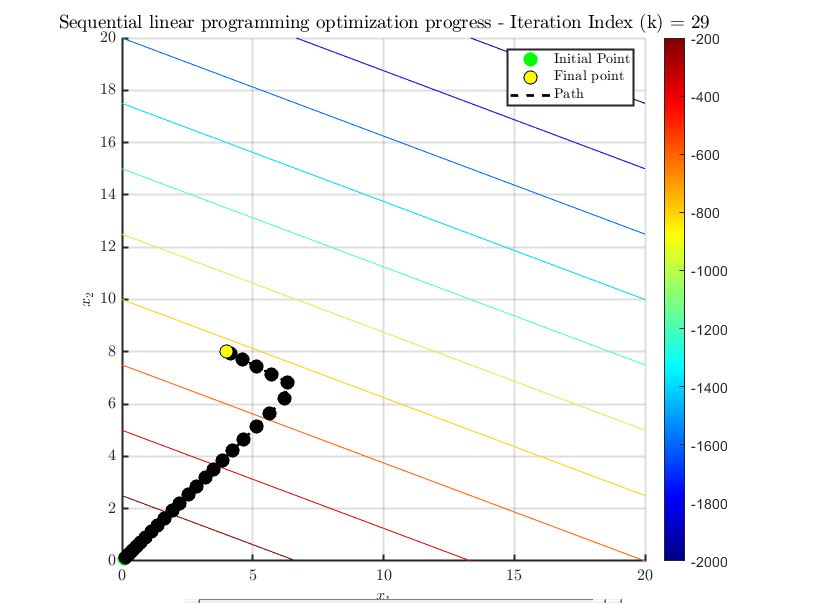

============================================================
      INTERACTIVE OPTIMIZATION VISUALIZATION TOOLBOX
============================================================

1. OVERVIEW
-----------
This MATLAB-based suite is designed for visualizing the performance and convergence of various optimization algorithms. It allows users to compare Gradient-Based and Population-Based methods through interactive plots, convergence figures, and frame-by-frame GIF exports with slider controls.

2. KEY FEATURES
---------------
* Algorithm Library: Includes Gradient Descent variants and 
  Population-based algorithms (e.g., PSO, GA).
* Interactive UI: Built-in sliders to "scrub" through iterations 
  to see how the search space evolves.
* GIF Generation: Automated tools to export your optimization 
  runs as high-quality animations.
* Visualization: 2D/3D contour and surface plots showing the 
  path of the optimizer.

3. REQUIREMENTS
---------------
* MATLAB R2018b or newer.
* Image Processing Toolbox (Required for image manipulation).

4. DIRECTORY STRUCTURE
----------------------
/src        - Core algorithm logic.
  /OptimizationAlgorithmFunctions
  /CommonCovergenceFunctions
  /CommonEvaluationFunctions
  /CommonVisulaizationFunctions
/sso-toolbox    - Utility functions for plotting and UI.
setup_optimization_visualization.m     - Environment configuration and path setup script.

5. GETTING STARTED
------------------
1. Open MATLAB.
2. Run 'setup_optimization_visualization_toolbox.m' located in the root folder. This script will:
   - Verify your MATLAB version.
   - Check for required toolboxes.
   - Add all subfolders to your path.
   - Change the current directory to the project root.
3. Open the 'src\OptimizationAlgorithmFunctions' folder and run a script (e.g., 'optimization_simplex.m').

6. ALGORITHMS INCLUDED
----------------------
### GRADIENT-BASED:
- Conjugate Gradient

- Steepest Descent

- Quasi Newton

- Modified Newton

- Linear Programming

- Quandratic Programming

- Sequential Linear Programming

- Sequential Quadratic Programming

### POPULATION-BASED:
- Particle Swarm Optimization (PSO)

- Genetic Algorithms (GA)

- Differential Evolution

7. Authors
---------------
- **Ali Abbas Kapadia (Main Author)**
- **Eduardo Rodrigues Della Noce (Contributor)**

8. CONTRIBUTING
---------------
If you wish to add a new algorithm, please ensure it outputs 
an iteration history matrix compatible with the visualization 
functions in the /Toolbox folder.
============================================================